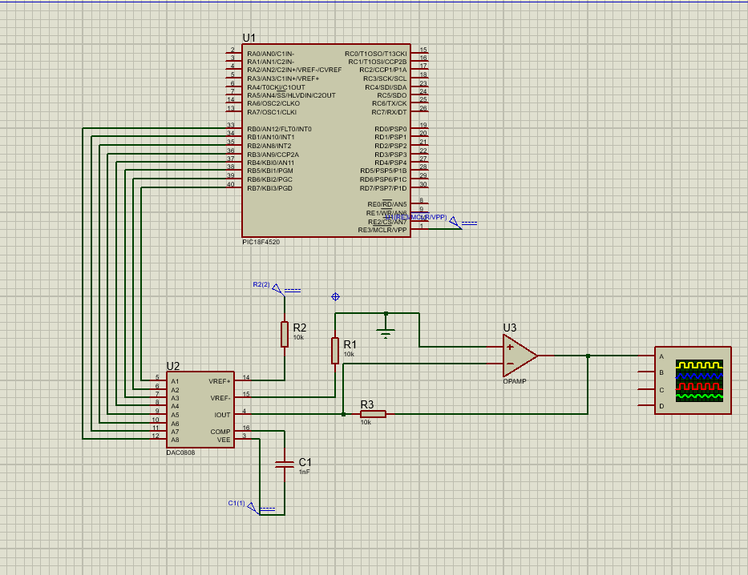
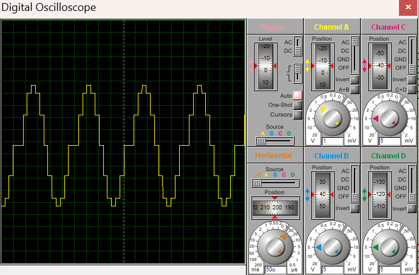
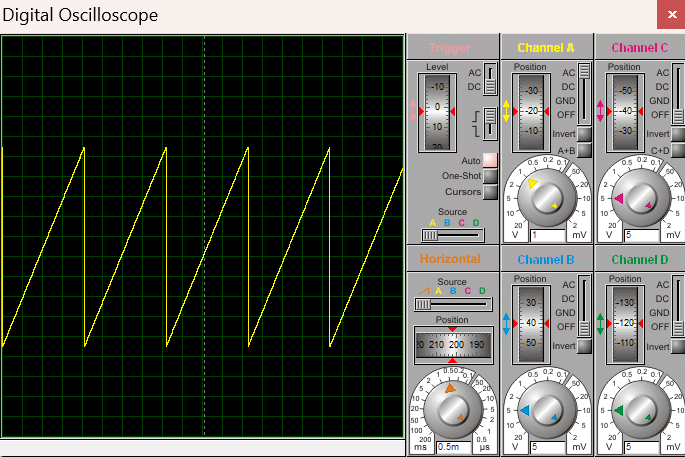
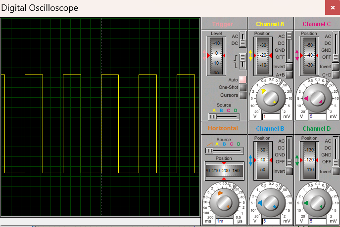
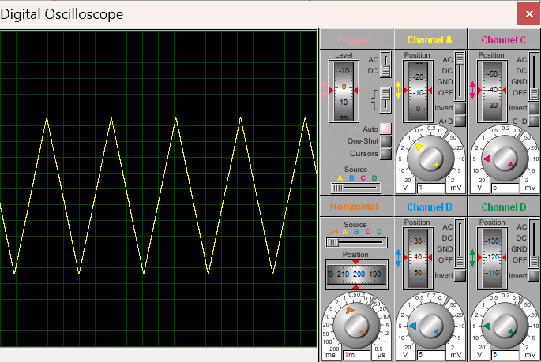

**DAC Interfacing**

**Objective:** To write C programming for waveform generation using DAC interface.

**Software(s) Used:**
- MPLAB X IDE
- XC8 Compiler
- Proteus 8 Professional

**Components:**
- PIC18F4520 microcontroller
- DAC0808
- OPAMP
- Resistors and Capacitor
- Digital Oscilloscope
  
**Description:** This practical demonstrates displaying various waveforms using digital inputs and converting them into analog outputs and showing them in the oscilloscope.

**Circuit Diagram:**

**Output:**
1) Sinwave

2) Ramp Wave

3) Square Wave

4) Triangular Wave

