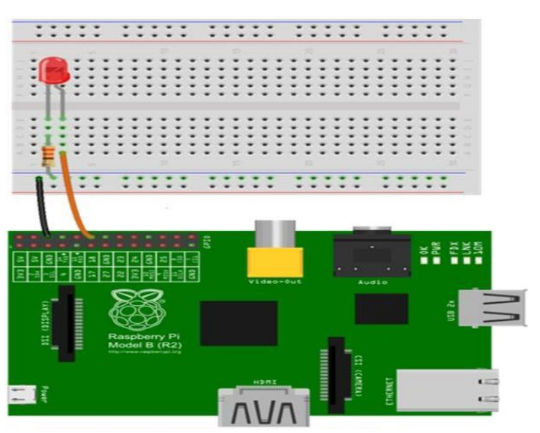

**AIM:** To study the interfacing of Light emitting diode with Raspberry Pi 3 B+ using Python program. 

**OBJECTIVES:**
- To write Python program to observe ON-OFF action of LED interfaced to Raspberry Pi 3 B+
- To understand Raspberry Pi 3 B+ connections for the interfacing a LED. 

**APPARATUS:** Raspberry Pi 3 B+, LED, 330Ω resistor, monitor, keyboard, mouse. 

**CIRCUIT DIAGRAM:**

