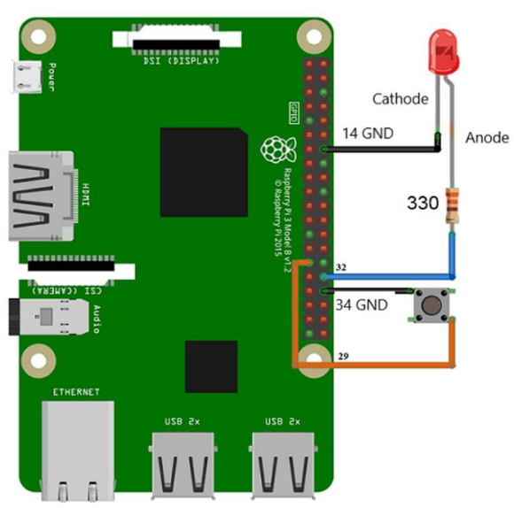

**AIM:** To interface the LED and push button to Raspberry Pi andwrite a Python Programming to control the LED and push button.

**OBJECTIVE:**
- To study the GPIO section of Raspberry Pi
- To interface LED and push button to Raspberry Pi.

**S/W PACKAGES AND H/W USED:**
Raspberry Pi 3 Model B or B+ Development Board, Python

**CIRCUIT DIAGRAM:**

