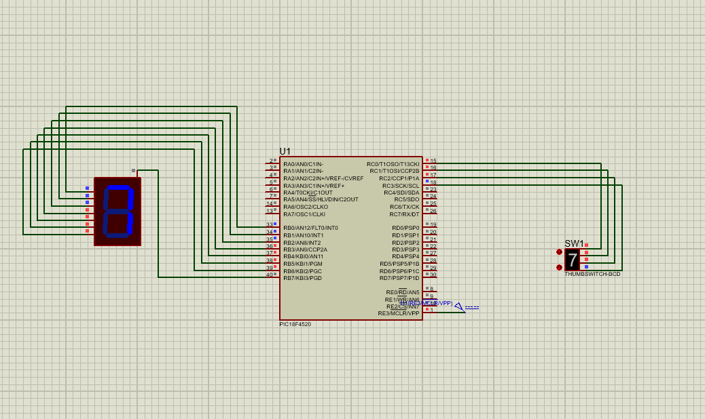

**BCD to 7-segment display**

**Objective**: To interface a BCD input with a seven segment display using the PIC18F4520 microcontroller.

**Software(s) Used:**
- MPLAB X IDE
- XC8 Compiler
- Proteus 8 Professional

**Components:**
- PIC18F4520 microcontroller
- 7-segment display (Common Anode)

**Description:** This practical demonstrates displaying BCD input on a seven segment display.

**Circuit Diagram:**

